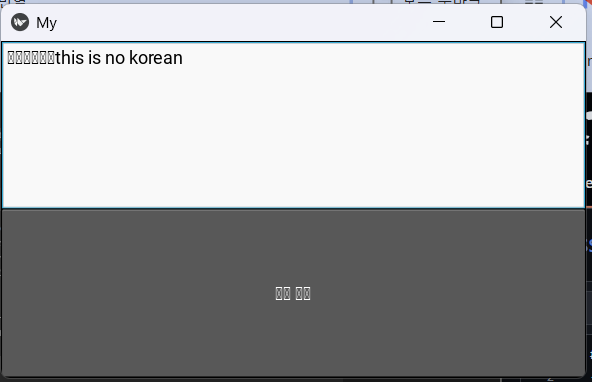
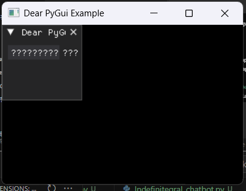
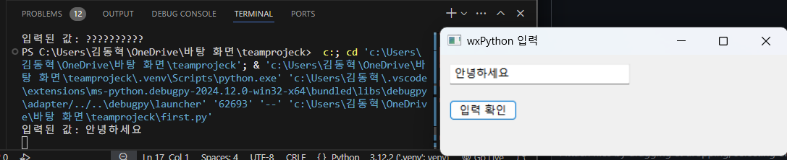

# 사례2: 실제 소프트웨어개발 구축
- chatGPT로 최초 소프트웨어를 생성
- 팀원들이 더욱 개선해 나가는 협업 과정(커밋에 여러 번 발생)
## 소프트웨어 
대화형 
### 소프트웨어 동기
- print을 하면 터미널에 나오는게 작아서 뭔가 창으로 나타내고 크게 나타내고 싶었다!
- 게임하다 보면 게임 캐릭터가 대화하는 창처럼 만들고 싶었다.
- 이거는 OSS보고서의 연장선으로 대화 내용이 OSS 이야기 중심으로 들어감
- 내 자기 캐릭터들 중으로 그림 (아직 정적분적인(결과값이 수로 나오는) 검색 앤진으로 인하여 무정적분 캐릭터로 그림)을 교육형 게임처럼 나타냈으면 좋겠다 

### 왜 wxpython으로 코딩하였는가?
Tkinter, pygame,  PyQt5 / PySide2, Kivy, wxPython 등 많은 대화창으로 만들 수 있다 
하지만 내가 임상 실험한 결과 Thinker하고 wxpython이 대화창이 정상이 되였다.
나머지들이 한글이 깨진다. (와 그때 꺠진 모습을 보면 장관이지)
- Kivy의 입력결과

- 이거 맞추면 치킨

- 성공

### 실행 방법
아직은 본체 프로그래밍 코드에 직접 실행(코드 열고 거기서 디버그)

##### 그림은??
krita인 오픈소스소프트웨어로 그림
- Krita는 주로 디지털 페인팅과 일러스트레이션에 사용되며
강력한 브러시 엔진과 다양한 기능을 갖추고 있어 디지털 아티스트들 사이에서 인기가 많습니다.

- Kri이떄까지 한 거
+ 대화창 패널 추가
+ 대화창, 글자 크기 창 비레 크기 조정
+ 이미지 (내가 그림)
+ 검색 추가
+ 검색 속성 결과로 리스트 순서대로 말해줌
------------
앞으로 할 것
+ 대화 속성의 리스트가 특정 부분의 리스트를 이미지 변화 할 거임 (그림 추가)
+ 대화 속성 내용 추가(아직 내용 다 넣지 않음)
+ 특정 명령어 입력하면 미니게임 혹은 대화창 결과 변화, 강제종료 등 여러 속성 추가
+ 그 외 변화
